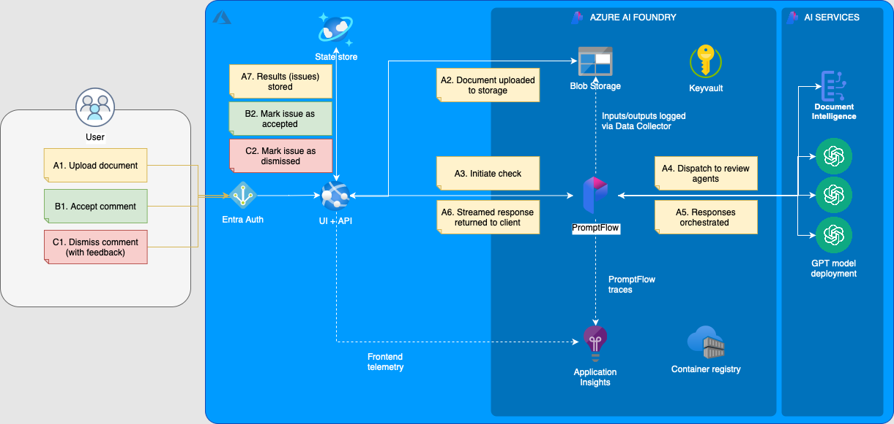

# AI Document Review System (智能文档审阅系统)

[](https://azure.microsoft.com/en-us/solutions/ai/)
[](./app/ui)
[](./app/api)
[](./infra)

An intelligent, human-in-the-loop document auditing system designed to automate the review of complex PDF documents. It combines state-of-the-art OCR (MinerU), Large Language Models (DeepSeek/OpenAI), and a responsive React frontend to identify, highlight, and correct compliance issues in real-time.



## ✨ Key Features

-   **Multi-Modal Parsing**: High-fidelity PDF extraction using **MinerU**, capable of understanding complex layouts, tables, and document structures.
-   **AI-Powered Auditing**: Configurable rule-based checking (e.g., "Definitive Language", "Grammar & Spelling") orchestrated by **LangChain**.
-   **Real-Time Streaming**: Issues are identified and streamed to the UI via Server-Sent Events (SSE) as they are processed, reducing perceived latency.
-   **Interactive Visualization**:
    -   **Dual-View Mode**: Side-by-side comparison of the original and annotated document.
    -   **Live Annotation**: Issues are highlighted directly on the PDF canvas using in-memory PDF manipulation.
-   **Human-in-the-Loop (HITL)**: Workflow for users to Accept, Dismiss, or Edit AI suggestions, ensuring high-quality data governance.
-   **Enterprise Ready**: Built on **Azure** (AI Hub, Cosmos DB, App Service) with Infrastructure-as-Code via Terraform.

## 🏗 Architecture Overview

The system follows a modern decoupled architecture:

### Frontend (`app/ui`)
-   **Framework**: React 18 + Vite + TypeScript.
-   **UI Library**: Microsoft Fluent UI for a native Office-like experience.
-   **Core Tech**: `react-pdf` for rendering, `annotpdf` for binary-level PDF highlighting.
-   **State**: Local React state management optimized for real-time SSE updates.

### Backend (`app/api`)
-   **Framework**: FastAPI (Python 3.12).
-   **AI Engine**: LangChain pipeline integrating DeepSeek (via OpenAI format) and Azure OpenAI.
-   **Database**: Azure Cosmos DB (Serverless SQL API) for issue tracking.
-   **Parsing**: Integration with MinerU v4 API for OCR and layout analysis.
-   **Coordination**: Asynchronous processing with `asyncio` and `sse-starlette`.

### Infrastructure (`infra`)
-   Fully managed capabilities via **Terraform**.
-   **Compute**: Azure App Service (Linux Web App).
-   **AI**: Azure AI Hub, Project, and Online Endpoints.
-   **Storage**: Azure Blob Storage (Documents) & Key Vault (Secrets).

## 🚀 Getting Started

### Prerequisites
-   **Node.js** 18+
-   **Python** 3.10+
-   **Azure CLI** (`az login` required for deployment)
-   **Terraform** (for infra deployment)

### Local Development

1.  **Clone the repository**
    ```bash
    git clone https://github.com/corlin/Document_Review_with_AI.git
    cd Document_Review_with_AI
    ```

2.  **Configuration**
    Copy the template environment file and fill in your API keys (DeepSeek/OpenAI, MinerU).
    ```bash
    cp .env.tpl .env
    # Edit .env with your credentials
    ```

3.  **Start the Application**
    Use the provided script to launch both backend (Port 8000) and frontend (Port 5173).
    ```bash
    ./start.sh
    ```

4.  **Access**
    Open [http://localhost:5173](http://localhost:5173) in your browser.

## 📖 Usage Guide

1.  **Upload**: Navigate to the "Files" tab and upload a PDF document.
2.  **Review**: Click on a document to enter the **Review Workspace**.
    -   The AI will automatically start scanning for issues.
    -   Issues appear in the left sidebar as they are found.
3.  **Interact**:
    -   **Click** an issue to jump to its location in the PDF (auto-scroll + focus highlight).
    -   **Compare**: Toggle "Compare Mode" to see the original vs. marked-up file.
    -   **Decide**: Click "Accept" to confirm an issue or "Dismiss" to ignore it.

## 🛠 Project Structure

```
├── app
│   ├── api          # FastAPI Backend
│   │   ├── main.py        # Entry point
│   │   ├── routers        # API Endpoints
│   │   └── services       # Business Logic (MinerU, LangChain)
│   └── ui           # React Frontend
│       ├── src
│       │   ├── pages      # Review & Files pages
│       │   └── services   # API clients
├── common           # Shared Pydantic models
├── flows            # PromptFlow definitions (AI Workflow)
├── infra            # Terraform Infrastructure code
├── docs             # Documentation & Images
└── Taskfile.yml     # Task runner configuration
```

## 🤝 Contributing

Contributions are welcome! Please follow the [GitHub Flow](https://guides.github.com/introduction/flow/):
1.  Fork the repo.
2.  Create a feature branch.
3.  Commit your changes.
4.  Open a Pull Request.

## 📄 License

This project is licensed under the MIT License.
